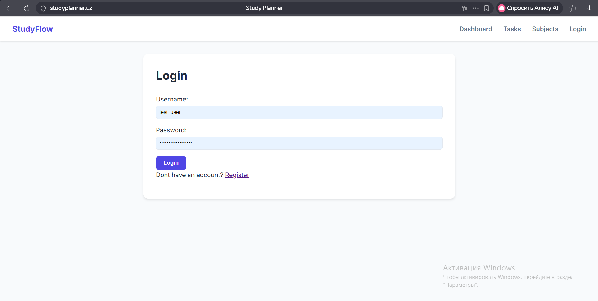
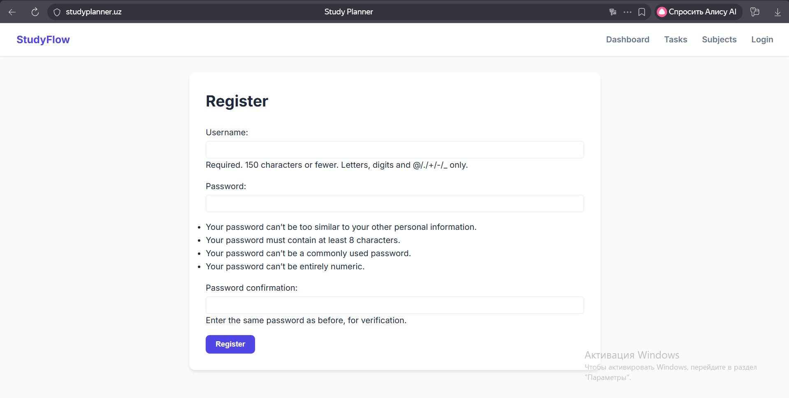
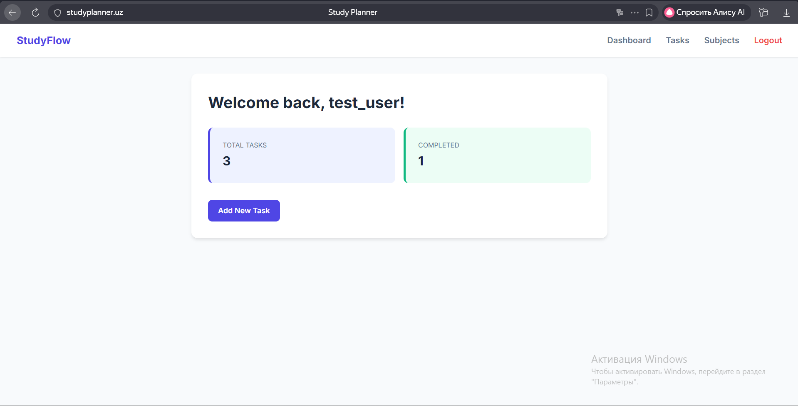
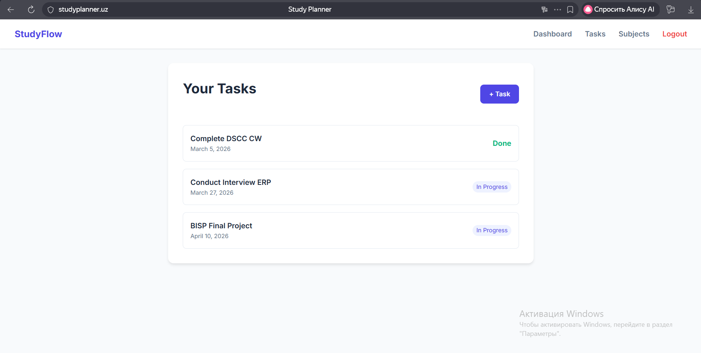
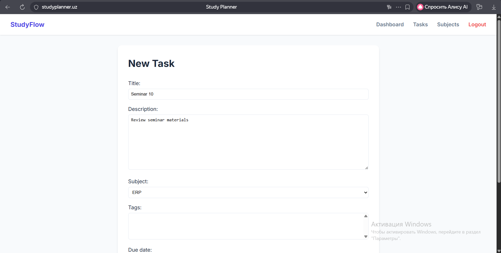
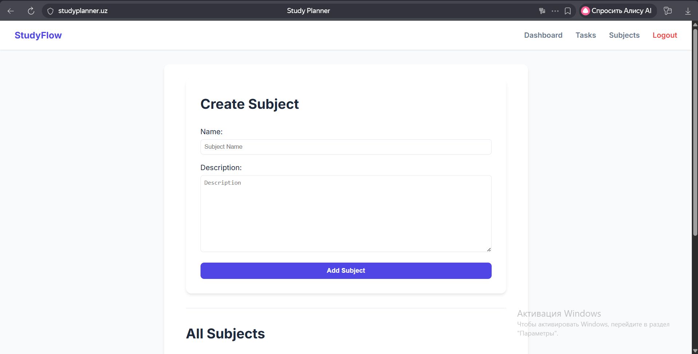
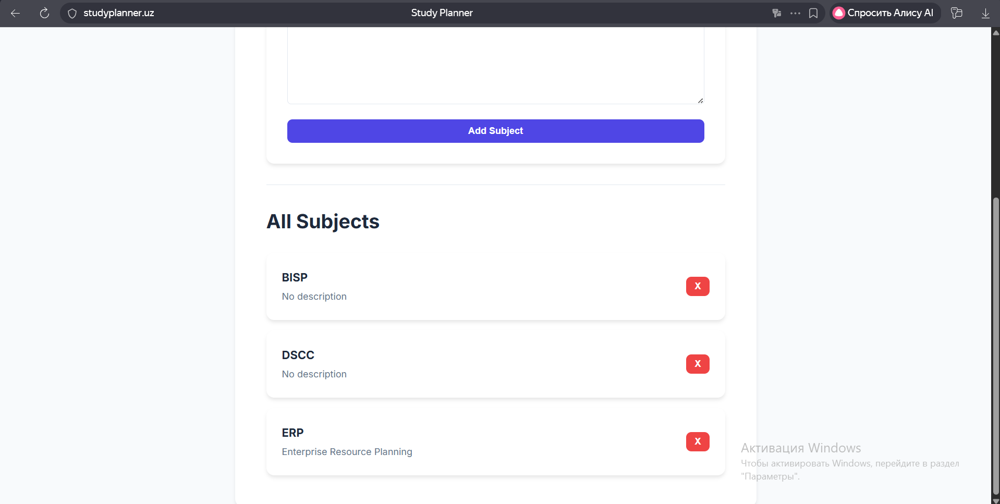
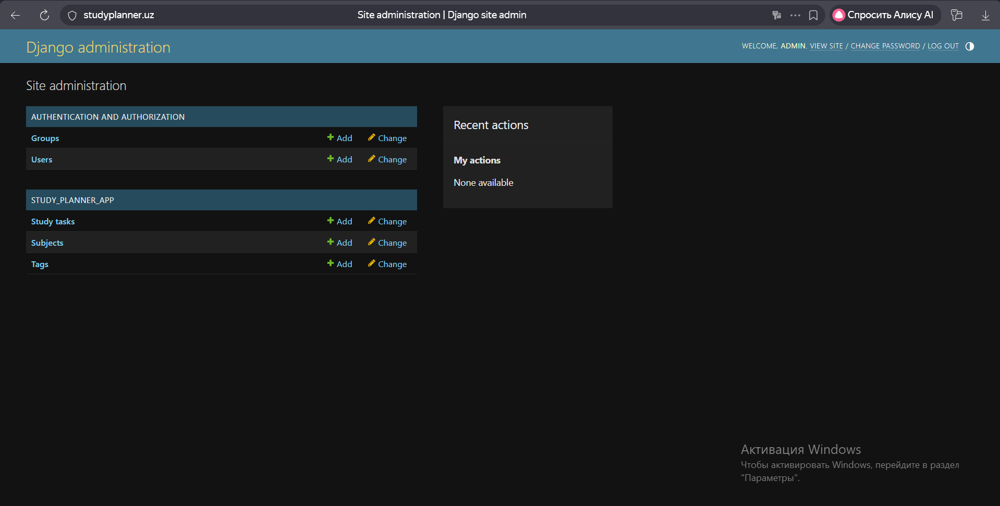

# Study Planner (DSCC Coursework)

Study Planner is a Django web application for managing personal study tasks.
This project was developed for the **Distributed Systems and Cloud Computing** coursework and faces the required DevOps flow: Docker containerization, multi-service architecture, production-style setup with Nginx + Gunicorn + PostgreSQL, and CI pipeline with GitHub Actions.

## Project Features

- User authentication: registration, login, logout
- Task management (CRUD): create, read, update, delete study tasks
- Subject management: create and delete subjects
- Task metadata: priority, status, due date, tags
- User-based access control (users can access only their own tasks)
- Django admin panel for data administration
- Health endpoint: `/health/`

## Tech Stack

- **Backend:** Django 4.2
- **Database:** PostgreSQL 15
- **Web server:** Gunicorn
- **Reverse proxy:** Nginx
- **Cache/queue (optional):** Redis
- **Containerization:** Docker, Docker Compose
- **Testing:** pytest, pytest-django
- **CI:** GitHub Actions

## Database Relationships

- `StudyTask -> User` (many-to-one)
- `StudyTask -> Subject` (many-to-one)
- `StudyTask <-> Tag` (many-to-many)

## Project Structure

```text
study_planner/
├── study_planner/                 # Django project settings and urls
├── study_planner_app/             # Main application (models, views, forms, templates)
├── nginx/                         # Nginx configuration
├── Dockerfile.multi               # Multi-stage Docker build
├── docker-compose.yml             # Main stack (web, db, nginx, redis)
├── docker-compose.prod.yml        # Production-like stack
├── .env.production.example        # Example production environment variables
├── .github/workflows/deploy.yml   # CI workflow
└── requirements.txt
```

## Local Setup (Docker)

### 1) Clone repository

```bash
git clone https://github.com/00016817wiut/DSCC_CW_16817.git
cd DSCC_CW_16817
```

### 2) Create `.env`

Create `.env` in project root (or copy from `.env.production.example` and adjust values):

```env
SECRET_KEY=your-secret-key
DEBUG=True
ALLOWED_HOSTS=localhost,127.0.0.1

DB_ENGINE=django.db.backends.postgresql
DB_NAME=study_planner_db
DB_USER=studyuser
DB_PASSWORD=studypass123
DB_HOST=db
DB_PORT=5432
```

### 3) Run project

```bash
docker compose up -d --build
```

### 4) Open application

- App: `http://localhost`
- Health: `http://localhost/health/`
- Admin: `http://localhost/admin/`

### 5) Create superuser (first run)

```bash
docker compose exec web python manage.py createsuperuser
```

## Production Deployment (VPS / Eskiz)

### 1) Prepare `.env.production`

```bash
cp .env.production.example .env.production
```

Update required values:

- `SECRET_KEY`
- `DEBUG=False`
- `ALLOWED_HOSTS` (server IP + domain)
- `DB_*` and `POSTGRES_*` values

### 2) Start production stack

```bash
docker compose -f docker-compose.prod.yml up -d --build
```

### 3) Verify

```bash
docker compose -f docker-compose.prod.yml ps
curl http://127.0.0.1/health/
```

Public checks:

- `http://<SERVER_IP>/`
- `http://<SERVER_IP>/health/`

### 4) Recommended security steps on server

- Configure UFW ports: `22`, `80`, `443`
- Use strong passwords and rotate temporary credentials
- Keep `.env.production` private

## Environment Variables

### Django app variables

| Variable | Required | Example | Purpose |
|---|---|---|---|
| `SECRET_KEY` | Yes | `very-long-secret` | Django secret key |
| `DEBUG` | Yes | `False` | Debug mode |
| `ALLOWED_HOSTS` | Yes | `localhost,127.0.0.1,studyplanner.uz` | Allowed hostnames |
| `DB_ENGINE` | Yes | `django.db.backends.postgresql` | Database engine |
| `DB_NAME` | Yes | `study_planner_db` | Database name |
| `DB_USER` | Yes | `studyuser` | Database user |
| `DB_PASSWORD` | Yes | `strong-password` | Database password |
| `DB_HOST` | Yes | `db` | Database host |
| `DB_PORT` | Yes | `5432` | Database port |

### PostgreSQL container variables

| Variable | Required | Example |
|---|---|---|
| `POSTGRES_DB` | Yes | `study_planner_db` |
| `POSTGRES_USER` | Yes | `studyuser` |
| `POSTGRES_PASSWORD` | Yes | `strong-password` |

## Testing

Run tests inside container:

```bash
docker compose exec web pytest -q -p no:cacheprovider
```

Current test coverage includes:

- auth redirect checks
- health endpoint check
- task creation ownership check
- permissions for foreign task access
- user-scoped task list check
- subject deletion check

## CI/CD

CI workflow file: `.github/workflows/deploy.yml`

Current CI stage includes:

1. Install dependencies
2. Run tests (`pytest`)
3. Build Docker image
4. Push image to Docker Hub (on push to `main`)

Required GitHub Secrets:

- `DOCKERHUB_USERNAME`
- `DOCKERHUB_TOKEN`

Deployment stage (CD via SSH) can be connected using additional secrets:

- `SSH_HOST`
- `SSH_USERNAME`
- `SSH_PRIVATE_KEY`
- `SSH_PORT`

## Useful Commands

```bash
# Start stack
docker compose up -d --build

# Check services
docker compose ps

# Follow logs
docker compose logs -f web

# Rebuild only web
docker compose up -d --build web

# Stop stack
docker compose down
```

## Screenshots of Running Application

### Login Page


### Register Page


### Dashboard


### Tasks List


### Create Task Form


### Subjects Page


### Subjects List


### Django Admin


## Access for Assessor

- Live URL: `https://studyplanner.uz/`
- Admin URL: `https://studyplanner.uz/admin/`
- Test user credentials: provided in the report

## Security Note

- Do not commit `.env`, `.env.production`, tokens, or private keys.
- If any token/password was exposed, rotate it immediately.
